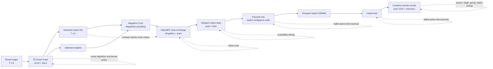
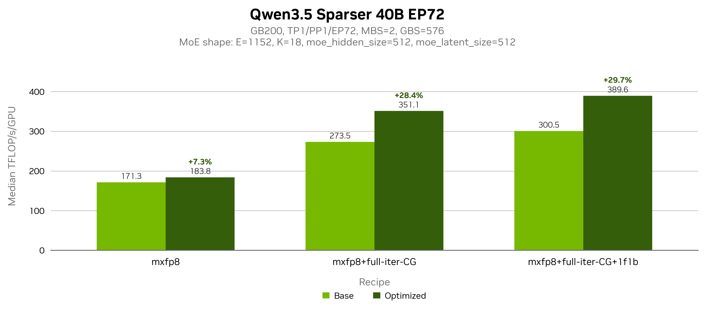
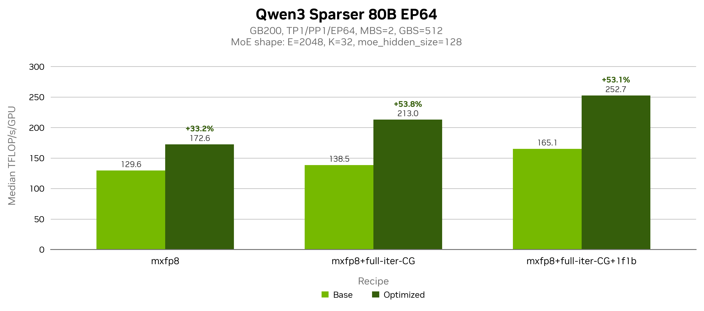
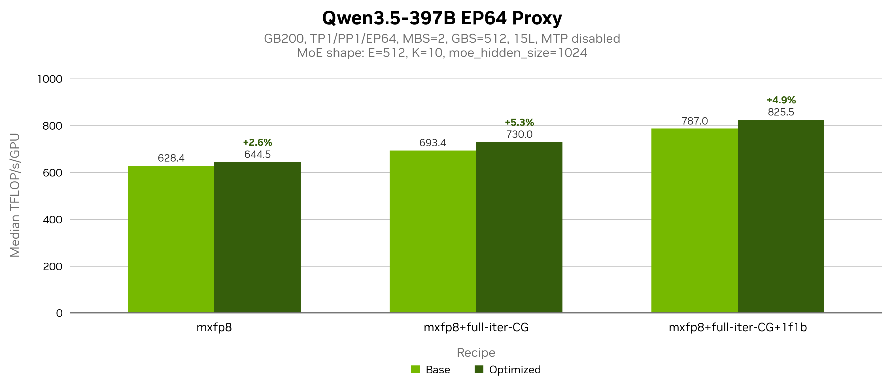
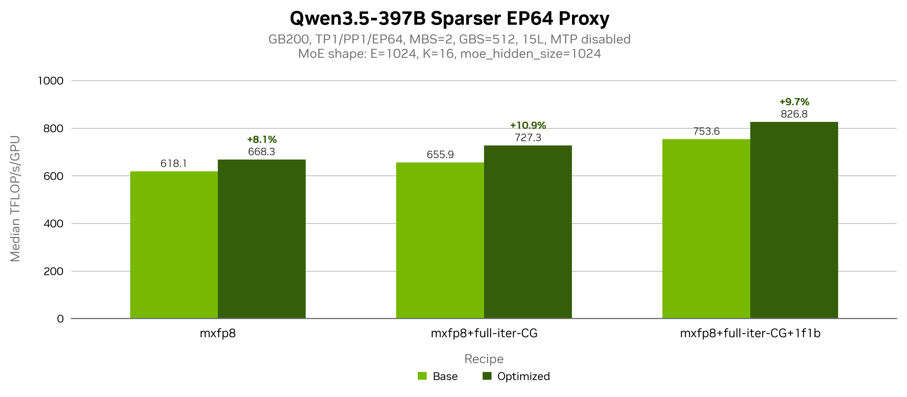
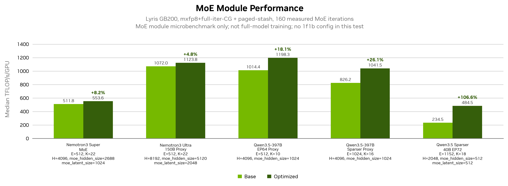

# Making Sparser MoE Practical

## Internship final-presentation content and evidence note

This note organizes the technical story for a final presentation. It is intentionally a
content narrative rather than a slide-layout specification.

The working Beamer implementation is in
`notes/final_presentation/beamer_presentation/`. Its `BRIEF.md` records the requested
deck structure and evidence constraints, while `main.tex`, `data/`, and
`scripts/plot_results.py` contain the reproducible slide implementation.

The central thesis is:

> Sparser MoE changes the performance problem. With thousands of experts, a large top-k,
> and a small latent expert hidden size, expert GEMMs become cheap while routing metadata,
> synchronization, and expert-parallel communication dominate. Recovering performance
> requires optimizing the complete router-to-HybridEP path, not one kernel in isolation.

The work covered four connected areas:

1. Profile a difficult `E=2304`, `top-k=36`, `EP=72`, latent-`H=512` workload across
   Megatron Core, Transformer Engine (TE), and HybridEP.
2. Remove large-expert/top-k regressions in TE fused-router forward and backward kernels.
3. Redesign and tune HybridEP's sparse path, including probability slicing, compact routing
   metadata, scan bitsets, permute/unpermute preprocessing, and combine-stage parameters.
4. Validate the optimization stack on additional sparse and conventional MoE shapes.

## Evidence conventions

The presentation should separate three kinds of numbers:

- **Isolated ablations:** same test shape with one implementation or launch-policy change.
  These are the strongest evidence for explaining an optimization.
- **Matched end-to-end comparisons:** same model and recipe, base versus the full optimized
  stack. These are the strongest product-level results.
- **Historical snapshots:** successive measurements as the software stack evolved. These
  show the investigation trajectory, but they are not a clean additive waterfall.

Use median post-warmup TFLOP/s/GPU for the later end-to-end model comparisons. Do not add
individual kernel speedups to predict training speedup: kernels overlap, different phases
reuse metadata differently, and the critical path moves after each fix.

## Content-priority guide

The core talk should preserve this causal spine:

```text
unusual 2304/36/EP72 shape
    -> whole-iteration profile
    -> router algorithm bottleneck
    -> compact route representation across TE / Megatron / HybridEP
    -> sparse HybridEP data movement and preprocessing
    -> combine-pipeline tuning and NCU explanation
    -> matched model results
    -> lessons
```

Must-show evidence:

- the target shape and early dispatch-versus-MLP timeline;
- radix top-k and merged TE results;
- the `[T,E] -> [T,K]` size model and cross-project propagation;
- probability slicing and ballot preprocessing;
- the two combine parameter sets and the tuning logic;
- dispatch-push versus combine-pull NCU evidence;
- matched end-to-end model gains with benchmark-scope labels.

Keep detailed direct-permute counters, CUDA-graph/skew diagnosis, full source maps, and the
later MoE-module-only suite as optional material. This keeps the main narrative about
Sparser-MoE mechanisms rather than every experiment performed during the internship.

---

# Recommended presentation narrative

## 1. Title and thesis

**Suggested title:** Making Sparser MoE Practical: Router and Expert-Parallel Optimizations

**Opening message:**

- Sparser MoE increases model capacity through many small experts.
- The target had `2304` experts, selected `36` experts per token, spread across `72` expert
  ranks, with latent hidden size `512`.
- This shape exposed scaling assumptions in both the fused router and HybridEP.
- The contribution was a full-stack, measurement-driven optimization of routing and
  expert-parallel communication.

**One-sentence outcome:** Large-expert routing was made scalable, HybridEP's sparse path was
specialized and tuned, and matched model benchmarks improved by up to `53.1%` end-to-end in
the June benchmark set and `106.6%` in the later MoE-module-only test set.

The two percentages come from different benchmark suites and should not be presented as if
they were directly comparable.

---

## 2. The target workload: why it is unusual

Use the original investigation shape as the running example:

| Dimension | Value | Performance implication |
| --- | ---: | --- |
| Total experts | `2304` | Router score rows and sparse metadata become wide |
| Router top-k | `36` | Selection and metadata work are no longer "small-k" |
| Expert parallelism | `72` | Routing information and tokens cross a large NVLink domain |
| Local experts/rank | `32` | Most local expert slots are inactive for a token |
| Latent/expert hidden size | `512` | Expert GEMMs and token copies are small and latency-sensitive |
| Micro/global batch | `2 / 576` | Original `EP72` training setup |

For one token, only about `36 / 8 = 4.5` of the `32` local-expert slots are active on an
eight-rank HybridEP microbenchmark. That means a loop over all 32 local experts does about
`86%` useless slot checks. The exact active count changes with topology, but the sparsity
principle remains.

**Speaker takeaway:** "More experts" does not merely scale the GEMM. It changes the dominant
data structures and makes fixed per-token or per-expert overhead visible.

---

## 3. End-to-end flow and ownership boundaries

Use this as the conceptual map for the rest of the talk:



The cross-project implementation path is:

1. TE computes selected expert indices and optionally writes a compact dense route map.
2. Megatron Core allocates and forwards that representation when both TE and the dispatcher
   support it.
3. HybridEP consumes it directly for route exchange, scan, dispatch, and combine.

**Speaker takeaway:** A representation change only pays off if it survives API boundaries.
Generating compact indices in TE and expanding them back to `[T,E]` in Python would lose the
benefit.

---

## 4. Initial profile: router and HybridEP dominated the captured GPU time

The rank-0 Nsight Systems report
`Qwen3-Next-80B-A3B-syncfree_profile-rank0-date_26-01-10_time_16-12-55-1482268.nsys-rep`
was exported to SQLite and classified in
`data/Qwen3-Next-80B-A3B-syncfree_profile-rank0-date_26-01-10_time_16-12-55-1482268/`.
Summed GPU execution time over all captured forward and backward launches was:

| Kernel group | GPU time |
| --- | ---: |
| Fused router | `3947.499 ms` |
| HybridEP combine | `1713.859 ms` |
| HybridEP dispatch | `1259.542 ms` |
| FlashAttention | `903.899 ms` |
| Other GEMM | `371.136 ms` |
| Grouped GEMM (expert MLP) | `286.147 ms` |

The fused router was `13.8x` the grouped expert-MLP time, while HybridEP combine plus
dispatch was `10.4x`. These are aggregate GPU-time counters, not a single-forward timeline
or additive wall-clock time: the capture contains forward and backward work on overlapping
streams.

The profile established the optimization order:

```text
profile whole iteration
    -> identify the current critical path
    -> isolate the responsible kernel or representation
    -> derive a bandwidth/latency lower bound
    -> change one mechanism
    -> verify correctness and microbenchmark
    -> re-profile the full model
```

**Speaker takeaway:** The optimization process followed the moving bottleneck. Fixing the
router exposed HybridEP; fixing dispatch exposed scan and combine.

### Launch-overhead baseline

Most launch-overhead reduction was upstream execution-system work: CuTe DSL sync-free
grouped GEMM and fused GroupedMLP, paged stash, full-iteration CUDA graphs, fused
quantization kernels, and larger microbatches where memory permits. The router and HybridEP
work in this presentation builds on that replayable baseline rather than claiming those
upstream gains as its own.

---

## 5. TE fused router: the large-`E`, large-`K` failure mode

The original selection path repeatedly scanned expert scores while finding the top-k. Its
work grew poorly with both expert count and selected count. At `E=2304`, `K=36`, two early
forward kernels were recorded at roughly:

- `6.4 ms -> 0.36 ms` for fused top-k with score function;
- `6.4 ms -> 0.34 ms` for the auxiliary-loss score path.

The first fix, merged as
[TransformerEngine PR #2821](https://github.com/NVIDIA/TransformerEngine/pull/2821),
introduced radix selection and fixed large dynamic-shared-memory handling. Local progress
records report more than `10x` kernel speedup at `2304/36` and about `1.35x` training
throughput in the then-current stack.

### Easy pseudocode: radix top-k

```text
scores = scores_for_one_token[0:E]
threshold_prefix = 0

for byte_position from most_significant to least_significant:
    histogram[0:256] = count byte(scores[e], byte_position)
                         for scores matching threshold_prefix

    bucket = bucket containing the K-th largest value
    threshold_prefix = threshold_prefix + bucket
    K = rank of desired value within that bucket

selected = experts whose encoded score is above the final threshold
resolve only threshold ties until exactly original_K experts remain
```

Why it works:

- Each radix pass scans the expert row once.
- The number of passes is fixed by score representation, rather than by `K`.
- Selection is therefore approximately `O(E)` instead of repeatedly scanning `E` for every
  selected expert.

### Important implementation details

- Use an online softmax path so scoring does not require extra full-row passes.
- Select the simple/naive kernel for genuinely small top-k shapes where radix setup is not
  worthwhile.
- Opt in to larger dynamic shared memory when wide expert rows require it.

**Speaker takeaway:** The algorithmic change removed the pathological scaling; the launch
policy preserved the fast small-k path.

---

## 6. TE fused router: turning the first fix into a robust kernel family

[TransformerEngine PR #3012](https://github.com/NVIDIA/TransformerEngine/pull/3012)
optimized forward and backward beyond the initial radix implementation:

- persistent-grid work distribution;
- double-buffered `cp.async` score loading;
- packed 8-bit radix histograms, reducing histogram registers from `32` to `4`;
- compile-time score-function dispatch;
- a simple path for small top-k;
- a two-pass backward design that removes an intermediate `comp_buf`.

The backward change is also a shared-memory optimization. The old intermediate scaled as
`E * warps_per_block * sizeof(float)`. At `E=2304` and four warps, that is about `36 KiB`
per block. The new structure computes the token-level reduction in pass 1 and writes scalar
gradients in pass 2, freeing that shared memory for buffering and occupancy.

### Easy pseudocode: overlap score loading and selection

```text
prefetch(score_tile[0], async_buffer[0])

for tile in token_tiles:
    wait(async_buffer[current])
    prefetch(score_tile[next], async_buffer[next])

    scores = async_buffer[current]
    compute score function
    run top-k / radix selection
    write selected indices and weights

    swap(current, next)
```

### B300 results from the merged PR

All values below are throughput for `8192` tokens:

| Kernel | Shape | Before | After | Gain |
| --- | --- | ---: | ---: | ---: |
| Top-k forward, softmax | `E=2304, K=36` | `673 GB/s` | `964 GB/s` | `+43%` |
| Top-k backward | `E=2304, K=36` | `543 GB/s` | `2766 GB/s` | `+410%` |
| Aux-loss forward | large-expert case | `645 GB/s` | `891 GB/s` | `+38%` |
| Aux-loss backward | large-expert case | `2272 GB/s` | `4201 GB/s` | `+85%` |
| Top-k forward | `E=512, K=4` | `1779 GB/s` | `1784 GB/s` | `+0.3%` |

The small case is important: it demonstrates that the deeper optimization did not trade
away conventional router performance. The PR test record reported `891` passing tests.

---

## 7. Compact dense routing: change the data structure, not only the kernel

The old HybridEP path could exchange a boolean route map of shape `[T,E]`. For sparse top-k
routing, the useful information is only the selected expert IDs, shape `[T,K]`.

[TransformerEngine PR #3129](https://github.com/NVIDIA/TransformerEngine/pull/3129)
added an optional dense selected-index output and matching backward support. Megatron Core
then passes this representation directly to HybridEP.

### Representation-size reasoning for the target

Assume a one-byte bool and a two-byte `int16` expert ID:

```text
old bytes/token = E       = 2304
new bytes/token = 2 * K   = 2 * 36 = 72
reduction       = E/(2K)  = 2304/72 = 32x
```

For `T=8192`:

| Representation | Local route metadata |
| --- | ---: |
| Bool `[T,E]` | `18.87 MB` |
| `int16 [T,K]` | `0.59 MB` |
| Reduction | `32x` |

For an idealized `72`-rank all-gather, the per-rank logical receive/send volume model is:

```text
bool:  T * E * (EP - 1)       ~= 1.34 GB
dense: T * K * 2 * (EP - 1)   ~= 41.9 MB
```

At a hypothetical sustained `0.9 TB/s`, the bool payload alone is about `1.49 ms`. This is a
lower-bound model, not a runtime prediction: protocol traffic, topology, synchronization,
and memory accesses are omitted.

### Easy pseudocode: API-level propagation

```text
if TE supports dense route output and HybridEP accepts it:
    dense_route = int16[T, K]
    TE_fused_router(logits, dense_route_out=dense_route)
    HybridEP_dispatch(..., dense_route=dense_route)
else:
    use compatibility route-map path
```

### Dense backward: avoid searching top-k for every expert

The first dense-backward implementation asked, for every expert, whether that expert
appeared in the token's selected indices:

```text
old:
    for token in T:
        for expert in E:
            scan selected_indices[token, 0:K]
    complexity ~= O(T * E * K)
```

The optimized path traverses the selected indices directly and zero-fills the full gradient
output where required:

```text
new:
    zero grad_logits[T, E]
    for token in T:
        for slot in K:
            expert = selected_indices[token, slot]
            write selected gradient
    complexity ~= O(T * (E + K))
```

Score functions with full-row coupling still need their mathematically required row-level
work; the key improvement is removing a redundant `K`-entry membership scan for every
expert.

### Compact metadata still needs an efficient collective

The HybridEP work also added an experimental TMA-based custom all-gather for routing
metadata. It writes directly into the registered HybridEP buffers and avoids an extra
NCCL-buffer-to-PyTorch-tensor copy. A historical NVL8 session recorded it at about `15%`
faster than NCCL for the tested routing-map collective.

Treat this as a supporting experimental result:

- it validates that collective overhead remains visible after payload compression;
- it was designed with the NVL72 path in mind;
- it is not a measured `15%` full-model or NVL72 speedup.

**Speaker takeaway:** Compact routing removes work proportional to the number of unselected
experts. The capability check keeps older TE or dispatcher combinations working.

---

## 8. HybridEP probability slicing: stop transmitting irrelevant columns

The original single-NVL-domain dispatch path sent probability data for the full expert set.
A destination rank only needs the probabilities for its own experts.

```text
old destination payload: probs[token, 0:E]
new destination payload: probs[token, experts_owned_by(destination_rank)]
```

For `EP=72`, this is up to a `72x` reduction in the per-destination probability slice under
an even expert partition. It does not imply a `72x` kernel speedup because token data,
addressing, TMA issue rate, and synchronization remain.

The probabilities cannot be removed entirely during training:

```text
forward:
    source -- hidden + selected probs --> expert rank
    expert output = FC2(probs * activation(FC1(hidden)))
    expert -- already weighted output --> source

backward:
    source -- grad output --> expert rank
    expert computes grad hidden + grad probs
    expert -- grad hidden + grad probs --> source
```

The optimization therefore sends the **necessary selected/local slice**, rather than
dropping probability communication or broadcasting all `E` columns. This distinction makes
the method easier to defend: it preserves training semantics while removing irrelevant
payload.

On an eight-B300 test, dispatch-with-probability bandwidth was recorded improving from about
`200 GB/s` to `600 GB/s`. In the later controlled `H=512`, `E_local=32`, `K=36` study:

| Kernel | Before | After | Speedup |
| --- | ---: | ---: | ---: |
| Dispatch with probability | `185.1 us` | `103.4 us` | `1.79x` |
| Dispatch without probability | `95.8 us` | `95.7 us` | parity |

The unchanged no-probability path is a useful control: the gain came from removing
unnecessary probability traffic, not from an unrelated launch change.

---

## 9. Permute/unpermute: iterate active experts, not all local slots

For the NVL8 test shape, a token activates about `4.5` of `32` local expert slots. The
reference preprocessing loop still tested every slot and used a fixed 128-thread group.

### Easy CUDA-like pseudocode

```cpp
// One lane tests one local expert slot.
bool active = route_slot[lane] != EMPTY;
uint32_t mask = __ballot_sync(FULL_MASK, active);

while (mask != 0) {
    int expert = __ffs(mask) - 1;
    mask &= mask - 1;  // remove the lowest set bit

    int token_id = __shfl_sync(FULL_MASK, my_token_id, expert);
    copy_or_accumulate(token_id, expert);
}
```

For latent `H=512` BF16, one token contains `64` `float4` values. A 32-thread warp provides
enough parallelism without the scheduling and coordination cost of 128 threads.

### Isolated results

| Kernel | Reference | Ballot path | Speedup |
| --- | ---: | ---: | ---: |
| Permute, `H=512` | `381 us` | `92 us` | `4.1x` |
| Unpermute, `H=512` | `265 us` | `128 us` | `2.1x` |
| Permute, `H=7168` | `937 us` | `912 us` | parity |
| Unpermute, `H=7168` | `1475 us` | `1098 us` | `1.34x` |

### Speed-of-light check

At `T=8192`, `H=512`, BF16, and `4.5` active copies/token:

```text
bytes ~= one input token read + 4.5 output-token writes
      ~= 46 MB

ideal HBM time at 8 TB/s ~= 5.7 us
```

Measured permute (`92 us`) and unpermute (`128 us`) remain `16x` and `22x` above this
payload-only lower bound. The residual is explained by scattered expert writes/reads,
cache-sector waste, and latency rather than arithmetic.

**Speaker takeaway:** Ballot removes control-flow waste. It cannot make scattered memory
accesses behave like a contiguous bandwidth test.

---

## 10. HybridEP combine tuning: the optimized parameter set is a contribution

This should be a first-class slide. The result was not merely "use more stages"; it was a
balanced tuple for the H=512 pull-and-reduce pipeline.

### Validated parameter sets

| Context | Combine SMs | G2S stages | S2G stages | Tokens/group | Reduce batch |
| --- | ---: | ---: | ---: | ---: | ---: |
| Controlled B300 NVL8 microbenchmark | `32` | `64` | `8` | `2` | `16` |
| Historical `E=2304`, `EP=72` launch | `32` | `72` | `8` | `2` | `72` |

The second row is the tuned production-launch tuple found for the 2,304-expert case. The
first row is the cleaner controlled experiment used to explain parameter sensitivity.
Treat them as workload-specific configurations, not universal defaults.

The corresponding environment variables are:

```bash
NUM_SMS_COMBINE=32
NUM_OF_STAGES_G2S_COMBINE_API=64       # 72 in the EP72 launch
NUM_OF_STAGES_S2G_COMBINE_API=8
NUM_OF_TOKENS_PER_GROUP_COMBINE_API=2
NUM_TOKENS_COMBINE_REDUCE_BATCH_COMBINE_API=16  # 72 in the EP72 launch
```

### How the parameters were found

The tuning process should be explained as a constrained pipeline search:

```text
fix a representative latent-MoE shape and correctness seed

for group in [1, 2, 4, 8]:
    calculate FIFO slots available per pipeline
    reject/flag settings with too little source-rank lookahead

    for G2S_depth in candidate depths:
        for reduce_batch in candidate batches:
            benchmark combine kernel and combine+unpermute API
            record time, output BW, SM count, and correctness

choose the shallowest queue that hides pull latency
choose the smallest group that uses both pipelines efficiently
confirm deeper queues and more SMs no longer improve performance
validate the final tuple in the full EP72 launch
```

This is why the final result is more informative than a single lucky launch: group scaling,
queue-depth saturation, batch sensitivity, SM efficiency, and end-to-end API behavior were
all checked.

### How the combine pipeline works

Each block has independent pipelines:

```text
G2S warp:
    issue remote TMA reads into a shared-memory FIFO

reduction warp group:
    wait for a batch of FIFO slots
    accumulate source tokens in FP32 registers
    write the reduced token to shared memory
    issue S2G TMA store
```

At `G2S=64` with two groups/pipelines, each pipeline gets `32` FIFO slots. With roughly
eight source ranks per output token, it can prefetch about four tokens:

```text
32 FIFO slots / 8 sources per token ~= 4 tokens of lookahead
```

### Why the tuple wins

- **Group `2`:** uses both pipelines. It achieved the same `~263-265 GB/s` as group `1`
  while using `32` rather than `64` SMs.
- **Group `4+`:** makes each FIFO too shallow to hide remote-read latency. Group `4` fell
  to about `133 GB/s`; larger groups were worse.
- **G2S `64`:** already provides enough lookahead on NVL8. Doubling it to `128` changed
  `246.1 us` to `245.0 us`, effectively no gain.
- **Batch `16`:** covers the roughly eight rank-level source contributions in one reduction
  cycle on the controlled NVL8 shape and avoids extra barriers.
- **S2G `8`:** provides store-side staging without taking shared memory away from the
  latency-critical G2S FIFO.
- **EP72 tuple:** the measured launch used G2S `72` and reduce batch `72`, matching the wider
  communication domain. It should be reported as the tuned 2,304-case setting rather than
  extrapolated from the NVL8 microbenchmark.

### Controlled tuning results

The default-versus-tuned table below comes from the earlier controlled B200 comparison at
the same latent `H=512`, `E_local=32`, `K=36` shape. The later B300 rebased run independently
validated the selected `64/8/group-2/batch-16` tuple and BF16/FP8 correctness.

| Measurement | Default | Tuned | Improvement |
| --- | ---: | ---: | ---: |
| Combine with probabilities, sparse-opt branch | `960.8 us` | `252.3 us` | `3.8x` |
| Combine without probabilities, sparse-opt branch | `877.4 us` | `210.9 us` | `4.2x` |
| Combine + unpermute API, sparse-opt branch | `1125.5 us` | `399.2 us` | `2.8x` |

With both the sparse changes and tuned combine:

| Path | Tuned reference | Tuned sparse path | Speedup |
| --- | ---: | ---: | ---: |
| Dispatch + permute API | `602.1 us` | `217.9 us` | `2.76x` |
| Combine + unpermute API | `531.6 us` | `399.2 us` | `1.33x` |
| Total | `1133.7 us` | `617.1 us` | `1.84x` |

**Speaker takeaway:** Stage count, grouping, and reduction batch form one pipeline design.
Increasing any single knob in isolation can waste SMs or remove the FIFO headroom needed to
hide NVLink latency.

---

## 11. Why combine remains harder than dispatch

NCU showed a structural push-versus-pull asymmetry:

| Metric | Dispatch | Combine |
| --- | ---: | ---: |
| Duration | `116.83 us` | `254.43 us` |
| Dominant traffic | `78.01 MB` TX | `73.90 MB` RX |
| Throughput | `650 GB/s` | `271 GB/s` |
| Long-scoreboard stall | `57.95%` | `26.59%` |
| Wait stall | `21.36%` | `25.92%` |
| Barrier stall | `0.05%` | `15.23%` |

```text
dispatch = push / S2G
    issue remote writes and continue
    bottleneck: TMA/NVLink backpressure

combine = pull / G2S + reduce
    request remote data
    wait for arrival
    synchronize producer and reduction warps
    reduce and store
```

Per output token, combine still pays approximately four named barriers, shared-memory
read/write, TMA issue overhead, and remote-read round-trip latency. The measured per-token
pipeline cost was about `1.9 us`.

This explains two negative observations:

- Doubling G2S depth after the latency is already covered gives no improvement.
- Fused combine+unpermute was about `14%` slower than standalone because unpermute waits
  behind the slowly produced combine chunks.

The practical recommendation for latent `H=512` was therefore the non-fused standalone
path. A tuned fused dispatch+permute could be about `2%` faster, but the gain was fragile
relative to its extra JIT variants and parameter surface.

---

## 12. Dense scan: bitsets replace repeated sparse membership work

After compact `[T,K]` routing landed, HybridEP still needed to determine local-expert and
destination-rank membership efficiently.

### Local-expert bitset

```text
local_expert_mask = 0

for expert_id in selected_experts[token]:
    if owner_rank(expert_id) == my_rank:
        local_expert_mask |= 1 << local_index(expert_id)

later membership test:
    active = local_expert_mask & (1 << local_expert)
```

This replaces nested local-expert/top-k comparisons with an `O(1)` register bit test. In
the fused-scan `E_local=32`, `K=36` cases it improved:

- `2044.7 -> 686.4 us` (`2.98x`) for one tested template;
- `1384.7 -> 583.1 us` (`2.37x`) for another.

### Rank bitset

```text
rank_mask[word(owner_rank)] |= bit(owner_rank)

needed_by_rank =
    rank_mask[word(candidate_rank)] & bit(candidate_rank)
```

Replacing a per-thread boolean rank array with compact `uint32_t` masks improved the
no-permute `512/108` scan from `525.6 us` to `331.7 us` (`1.58x`). BF16 and FP8 correctness
passed on the full eight-rank test.

**Speaker takeaway:** The winning change was representation compression and constant-time
membership checks. A more aggressive warp-pruning loop was rejected because reductions,
`ffs` control flow, and row initialization cost more than the skipped work.

---

## 13. Negative results: profiling prevented attractive but wrong optimizations

Keep this concise in the main talk; move detailed counters to the appendix.

### Direct dispatch into expert-contiguous output

The idea was to eliminate the later permute. NCU showed that it instead wrote each token
once per selected expert rather than once per destination rank.

| Test | Direct versus staged dispatch |
| --- | --- |
| `K=4` | `1.36x` slower, `3.2x` more user NVLink TX, `49x` more L1 sectors |
| `K=8` | `2.2x` slower, `4.0x` more user NVLink TX, `97x` more L1 sectors |
| Target `K=36` | projected `~4.5x` NVLink amplification and `~4-5x` slowdown |

The staged copy plus an optimized permute is cheaper for small `H`, large `K`.

### Fused combine + unpermute

The consumer serializes behind a pull-based combine pipeline. Even after tuning, fused
combine+unpermute was `434 us` versus `381 us` standalone, about `14%` slower.

### Warp-pruned dense scan

Skipping whole expert loops looked promising, but the added warp reductions and
set-bit iteration produced mixed results and regressions. The simpler rank bitset was kept.

**Speaker takeaway:** A removed kernel is not automatically removed work. It may amplify
remote traffic or move serialization into a harder-to-hide place.

---

## 14. Results on the original 2,304-expert investigation

Use a timeline, not an additive waterfall:

| Historical stack snapshot | Approx. TFLOP/s/GPU | What changed |
| --- | ---: | --- |
| Initial profile | `~92` | Router and expert-parallel overhead exposed |
| Initial TE router fix | `~158` | Radix large-`E`, large-`K` router path |
| Refined HybridEP sparse stack | `~310` | Probability slicing, dense routing, ballot preprocessing, combine tuning |
| Later dense scan/bitset stack | `~400` | Compact route plumbing plus local-expert and rank bitsets |

The documented May comparison was `158 -> 310 TFLOP/s/GPU` after HybridEP sparse
optimizations on the `E=2304`, `EP72` model. That run also used the surrounding training
stack of CuTe DSL grouped GEMM, MXFP8, paged stash, full-iteration CUDA graph, and MoE 1f1b
overlap. The later `~320 -> ~400` scan result is another evolving-stack snapshot.

Therefore:

- use the timeline to show how the critical path moved;
- use the isolated kernel tables to attribute mechanisms;
- do not label `92 -> 400` as a controlled single-stack speedup.

---

## 15. Generalization: matched end-to-end model benchmarks

The June `hepS2F2` stack combined:

- TE PR #3012 and dense route output;
- Megatron Core dense-route propagation;
- HybridEP compact route/scan changes;
- probability-transfer, permute/unpermute, and combine sparse optimizations.

Matched median TFLOP/s/GPU gains over `2604base`:

| Model | Baseline recipe | Paged stash | Paged stash + 1f1b |
| --- | ---: | ---: | ---: |
| Qwen3.5 Sparser 40B, EP72 | `+7.3%` | `+28.4%` | `+29.7%` |
| Qwen3 Sparser 80B, EP64 | `+33.2%` | `+53.8%` | `+53.1%` |
| Qwen3.5 397B EP64 proxy | `+2.6%` | `+5.3%` | `+4.9%` |
| Qwen3.5 397B sparser EP64 proxy | `+8.1%` | `+10.9%` | `+9.7%` |

Use the existing result figures:









**Interpretation:** The gain grows when expert count/top-k and runtime overlap make routing
and expert-parallel overhead a larger fraction of the step. Conventional shapes still
benefit, but less dramatically.

---

## 16. Later MoE-module benchmark: broader shape coverage

The July benchmark measured `160/160` MoE-module performance iterations with full-iteration
CUDA graph and paged stash, without 1f1b. It is not a full-model training benchmark.

| Shape | Base | Optimized | Gain |
| --- | ---: | ---: | ---: |
| NT3 Super MoE estimate | `511.8` | `553.65` | `+8.2%` |
| Nemotron Ultra proxy | `1072.0` | `1123.8` | `+4.8%` |
| Qwen397 EP64 | `1014.4` | `1198.3` | `+18.1%` |
| Qwen397 Sparser EP64 | `826.2` | `1041.5` | `+26.1%` |
| Qwen40 Sparser EP72 | `234.5` | `484.5` | `+106.6%` |



Use this after the matched full-model slide and state the scope explicitly. Its purpose is
to demonstrate that the optimization stack is most valuable on sparse-heavy shapes, not to
replace the end-to-end training results.

---

## 17. Closing takeaways

1. **Sparser MoE is a system problem.** Large `E`, large `K`, and small expert dimensions
   move the bottleneck from GEMM toward routing, metadata, synchronization, and NVLink.
2. **Algorithm and representation changes create the largest wins.** Radix selection and
   `[T,K]` route metadata remove work that scales with the wrong dimension.
3. **Small-token kernels need sparse control flow.** Ballot/bitsets avoid checking inactive
   local experts and ranks.
4. **Communication launch parameters are architectural choices.** The tuned 2,304-case
   combine tuple—G2S `72`, S2G `8`, group `2`, batch `72`, `32` combine SMs—was a concrete
   result, supported by controlled NVL8 sensitivity studies.
5. **SOL analysis explains the remaining gap.** Combine is a pull-and-reduce pipeline with
   remote-read round trips and barriers; it cannot be treated as a symmetric reverse
   dispatch.
6. **Negative results narrowed the design space.** Direct-permute and fused combine moved or
   amplified work rather than eliminating it.
7. **The stack generalized.** The largest matched end-to-end gains appeared on the most
   routing-intensive sparse shapes, reaching `+53.1%` in the June suite.

**Possible final sentence:**

> The main lesson is to preserve sparsity end to end—from selection algorithm, to metadata
> representation, to communication payload, to kernel control flow—while tuning the
> remaining communication pipeline for the actual topology.

---

# Optional appendix material

## A. Combine tuning sensitivity table

| Configuration | Combine time | Output throughput | Interpretation |
| --- | ---: | ---: | --- |
| Group `1`, `64` SMs | `252 us` | `265 GB/s` | Full FIFO depth, but half the warp resources are underused |
| Group `2`, `32` SMs | `254 us` | `263 GB/s` | Same throughput with half the SMs |
| Group `4`, `32` SMs | `502 us` | `133 GB/s` | FIFO too shallow to cover pull latency |
| G2S `64` | `246.1 us` | — | About four tokens of lookahead |
| G2S `128` | `245.0 us` | — | No meaningful gain; depth is not the limiter |

## B. Clean controlled HybridEP summary

Test shape: B300 NVL8, `T=8192`, `H=512`, `E_local=32`, `K=36`, `32` dispatch SMs,
`32` combine SMs, G2S `64`, S2G `8`, batch `16`, group `2`.

Both BF16 and FP8 correctness passed for:

- dispatch/combine;
- dense routing;
- standalone dispatch+permute and combine+unpermute;
- fused dispatch+permute and combine+unpermute.

Representative BF16 kernel-only results on the rebased branch:

| Kernel | Time | Effective throughput |
| --- | ---: | ---: |
| Dispatch with probabilities | `103.0 us` | `647.93 GB/s` |
| Dispatch without probabilities | `94.4 us` | `706.65 GB/s` |
| Combine with probabilities | `249.4 us` | `267.57 GB/s` |
| Combine without probabilities | `210.0 us` | `317.83 GB/s` |

## C. Router PR progression

| PR | Main contribution | Status |
| --- | --- | --- |
| [TE #2821](https://github.com/NVIDIA/TransformerEngine/pull/2821) | Large top-k/expert correctness and radix top-k foundation | Merged |
| [TE #3012](https://github.com/NVIDIA/TransformerEngine/pull/3012) | Persistent/async/packed-radix forward and backward optimization | Merged |
| [TE #3129](https://github.com/NVIDIA/TransformerEngine/pull/3129) | Optional dense `[T,K]` output and backward support | Merged |

## D. Source-level implementation map

These are useful for backup slides or a code walkthrough:

| Contribution | Source |
| --- | --- |
| Radix selection helpers | [`TE/transformer_engine/common/fused_router/utils.h`](../../TE/transformer_engine/common/fused_router/utils.h) |
| Async score loader | [`TE/transformer_engine/common/fused_router/async_loader.h`](../../TE/transformer_engine/common/fused_router/async_loader.h) |
| Router launch policy and dense output | [`TE/transformer_engine/common/fused_router/fused_topk_with_score_function.cu`](../../TE/transformer_engine/common/fused_router/fused_topk_with_score_function.cu) |
| TE PyTorch dense-route API | [`TE/transformer_engine/pytorch/csrc/extensions/router.cpp`](../../TE/transformer_engine/pytorch/csrc/extensions/router.cpp) |
| Megatron Core route allocation/capability gate | [`MLM/megatron/core/transformer/moe/router.py`](../../MLM/megatron/core/transformer/moe/router.py) |
| Megatron Core HybridEP forwarding | [`MLM/megatron/core/transformer/moe/fused_a2a.py`](../../MLM/megatron/core/transformer/moe/fused_a2a.py) |
| HybridEP ballot permute/unpermute | [`DeepEP/csrc/hybrid_ep/extension/permute.cu`](../../DeepEP/csrc/hybrid_ep/extension/permute.cu) |
| HybridEP TMA custom all-gather | [`DeepEP/csrc/hybrid_ep/extension/allgather.cu`](../../DeepEP/csrc/hybrid_ep/extension/allgather.cu) |
| HybridEP dense rank masks/scan | [`DeepEP/csrc/hybrid_ep/backend/hybrid_ep_backend.cuh`](../../DeepEP/csrc/hybrid_ep/backend/hybrid_ep_backend.cuh) |
| HybridEP combine parameters | [`DeepEP/csrc/hybrid_ep/config.cuh`](../../DeepEP/csrc/hybrid_ep/config.cuh) |

## E. Evidence and record map

### Primary local records

- [HybridEP sparse optimization and NCU analysis](../hybrid-ep-sparse-opt-new.md)
- [Rebased HybridEP correctness and bandwidth results](../hybrid_ep_rebased_bw_results.md)
- [TE fused-router optimization progression](../te_fused_router_optimization.md)
- [Permute/unpermute ballot optimization](../permute_unpermute_optimization.md)
- [Dense scan bitset benchmarks](../isolated-scan-bench.md)
- [Direct-permute NCU analysis](../direct_permute_ncu_analysis.md)
- [NVL72 CUDA-graph/skew diagnosis](../../reports/nvl72_cg_vs_nocg_report.md)
- [HybridEP implementation reference](../../DeepEP/docs/Hybrid-EP_Implementation.md)
- [June 8 progress summary](../top5_things_2026_06_08.md)
- [Confluence Top 5 transcript](../../reports/top5_confluence_transcript.md)
- [June matched model benchmarks](../../../agentic-mcore-dev/notes/qwen_tflops_gain/README.md)
- [July MoE-module benchmark summary](../../../agentic-mcore-dev/notes/moe_perf_test_20260719/summary.md)
- [Original 2,304-expert model configuration](../../../megatron-moe-scripts/model_configs/benchmarking/Qwen3-Next-80B-A3B_E72.yaml)
- [Original tuned EP72 launch](../../../megatron-moe-scripts/launch_qwen_manyMOE_oci-hsg.sh)

### Original presentation artifacts

- [Shared Sparser MoE PDF](</Users/harry/Downloads/Harrys Copy of Sparser MoE (2).pdf>)
- [Previous Sparser MoE PowerPoint](</Users/harry/Library/CloudStorage/OneDrive-NVIDIACorporation/Presentations/SparserMoEOptimizations.pptx>)
- [Shared Google document](https://docs.google.com/document/d/1iRopu2nZdLAUNSmLzGAjHYTIESVbuQ7uKsXyyYMIFO4/edit)
- [TE fused-router optimization document](https://docs.google.com/document/d/1oFisyasi469EG_3ExL4LF0ioIru6Hy8UV0JS2UGVruo/edit)

### Figure inventory copied for the future deck

- [`assets/hybrid_ep_workflow.svg`](assets/hybrid_ep_workflow.svg)
- [`assets/qwen3_5_sparser_40b_ep72.png`](assets/qwen3_5_sparser_40b_ep72.png)
- [`assets/qwen3_sparser_80b_ep64.png`](assets/qwen3_sparser_80b_ep64.png)
- [`assets/qwen3_5_397b_ep64_proxy.png`](assets/qwen3_5_397b_ep64_proxy.png)
- [`assets/qwen3_5_397b_sparser_ep64_proxy.png`](assets/qwen3_5_397b_sparser_ep64_proxy.png)
- [`assets/moe_module_perf_20260719.png`](assets/moe_module_perf_20260719.png)

## F. Claims to avoid

- Do not call the historical `~92 -> ~400` sequence a controlled `4.3x` training
  optimization; the runtime stack changed between snapshots.
- Do not claim the bool-to-dense metadata reduction alone produces a `32x` runtime gain.
  It is a representation-size ratio.
- Do not call `0.9 TB/s` an achieved end-to-end all-gather bandwidth. It is an idealized
  lower-bound assumption.
- Do not imply combine can reach dispatch throughput through stage tuning alone. NCU shows a
  structural pull/read-and-reduce cost.
- Do not present the NVL8 combine tuple as a universal default. Show it as the controlled
  sensitivity result and show the EP72 tuple separately.
- Do not mix the July MoE-module-only benchmark with full-model training results.
- Do not turn the custom-allgather NVL8 result into a full-model or NVL72 claim. It is an
  isolated collective result from the historical session record.

## G. Optional system-level diagnosis: cross-rank skew

An earlier NVL72 comparison initially made `device_sync` appear to be the dominant HybridEP
cost. Full-iteration CUDA graph changed the diagnosis:

| Backward MoE-cycle metric | No graph | Full-iteration graph |
| --- | ---: | ---: |
| Pre-dispatch synchronization | `2914 us` | `67 us` |
| Pre-combine synchronization | `3870 us` | `59 us` |
| Total barrier share | `46.5%` | `2.6%` |

The evidence pointed to CPU kernel-launch jitter amplified by the worst-of-72-ranks effect,
not an intrinsically expensive barrier protocol. With launches made deterministic, combine
became the largest measured phase at `37.7%` of that backward MoE cycle.

Use this only as a profiling-method appendix:

- the two profiles used different combine batch parameters;
- the `2.08x` total-cycle difference is not a clean CUDA-graph-only ablation;
- the defensible conclusion is that synchronization time was mostly arrival skew, and
  removing the skew exposed combine as the next critical path.

One subsequent session proposed interleaving G2S reads across multiple output tokens to hide
the remaining remote-read latency. Only scaffolding was implemented before the compute
allocation ended, so this is a **future-work hypothesis**, not a completed optimization.
