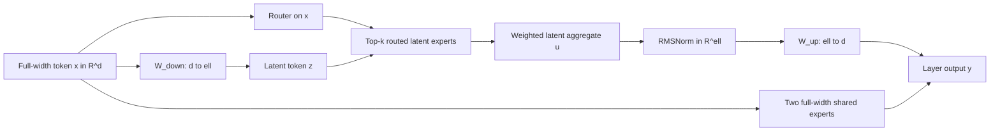
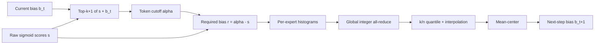

# Kimi K3 MoE: design, mathematics, and implementation

## Scope

This note connects Kimi K3's MoE design in the
https://
to the corresponding cuDNN Frontend, Transformer Engine (TE), and Megatron Core (MCore)
implementation work.

The scope is **K3 MoE support**, not a complete K3 model. Kimi Delta Attention, Gated MLA,
Attention Residuals, MoonViT-V2, Per-Head Muon, and the other training and inference
systems are outside this work.

The three MoE mechanisms covered here are:

1. **Stable LatentMoE:** full-width shared experts plus routed experts in a half-width latent
   space, with RMSNorm after routed aggregation and before the latent up-projection.
2. **SiTU-GLU:** a smoothly bounded SwiGLU-like activation with exact forward/backward
   support in ordinary and grouped expert paths.
3. **Quantile Balancing (QB):** auxiliary-loss-free routing that replaces a fixed-step sign
   update with a global-batch quantile/coordinate-minimization update.

The report equations are kept separate from implementation-specific choices and measured
results.

## 1. K3 MoE configuration from the report

K3 increases both the expert pool and the number of experts selected per token. LatentMoE
makes that practical by routing a compressed representation instead of the full-width
token.

| Quantity | Kimi K3 value |
| --- | ---: |
| Total parameters | 2.78T |
| Activated parameters | 104.2B |
| Transformer layers | 93 |
| Dense layers | 1 |
| Model width `d` | 7,168 |
| Routed latent width `ell` | 3,584 (`0.5d`) |
| Expert FFN hidden width | 3,072 |
| Routed experts `n` | 896 |
| Selected experts/token `k` | 16 |
| Full-width shared experts `N_s` | 2 |
| Activation | SiTU-GLU |

Only `16 / 896 = 1 / 56` of the routed expert pool is active for each token. The report
calls this a sparsity of 56. That extreme sparsity creates two stability problems:

- the routed branch is a long composition of the latent down-projection, a gated expert
  FFN, and the latent up-projection, so activation scale can grow through several matrix
  multiplications;
- balancing 896 experts is much harder than balancing a small expert pool, and imbalance
  directly reduces expert-parallel utilization.

Stable LatentMoE addresses these with routed-aggregate RMSNorm, SiTU-GLU, and Quantile
Balancing.

## 2. Stable LatentMoE

### 2.1 Execution graph

The router and shared experts consume the original full-width representation. Only the
routed branch is compressed.



For a full-width token `x in R^d`, define

$$
z = W_{\downarrow}x \in \mathbb{R}^{\ell}.
$$

Let `T_k(x)` be the selected routed experts and `p_i` their normalized router weights.
K3 report Eq. 11 is

$$
u = \sum_{i \in T_k(x)} p_i E_i^{\mathrm{routed}}(W_{\downarrow}x),
$$

$$
y = \sum_{j=1}^{N_s} E_j^{\mathrm{shared}}(x)
    + W_{\uparrow}\operatorname{RMSNorm}(u),
\qquad N_s = 2.
$$

The dimensions clarify which work is latent and which remains full-width:

- `E_i^routed: R^ell -> R^ell` operates only in latent width;
- `E_j^shared: R^d -> R^d` remains full-width;
- `W_down: R^d -> R^ell` is shared before routed dispatch;
- `W_up: R^ell -> R^d` runs once after weighted routed aggregation.

The shared path does **not** pass through `W_down`, the routed experts, routed RMSNorm, or
`W_up`.

### 2.2 Why RMSNorm is placed after aggregation

Without the added norm, the up-projection sees

$$
u = \sum_i p_i E_i(z),
$$

whose magnitude varies with the selected experts, their internal activations, and the
router weights. K3 instead feeds

$$
\widehat{u}
= \operatorname{RMSNorm}(u)
= \gamma \odot \frac{u}
{\sqrt{\frac{1}{\ell}\sum_{r=1}^{\ell}u_r^2 + \epsilon}}
$$

to `W_up`. This removes most aggregate-scale variation before returning to model width.

The resulting order is

```text
route full-width x
  -> W_down
  -> dispatch and routed experts
  -> probability-weighted combine
  -> RMSNorm
  -> W_up
  -> add full-width shared-expert output
```

It is **not** `RMSNorm(W_up(u))`, and it is not a norm before `W_down`.

### 2.3 MCore implementation

The paired latent-RMSNorm PRs are
https:// (`dev`) and
https:// (`main`). They add an opt-in
`moe_latent_up_projection_rmsnorm` selector and use a thin MCore wrapper around TE
`LayerNormLinear(normalization="RMSNorm")` for the duplicated latent up-projection.

Implementation details:

- only the latent up-projection changes; `W_down` and the shared experts remain unchanged;
- the module executes locally with `tp_size=1` because this projection is duplicated across
  TP ranks, while preserving its owning TP group for checkpoint and gradient metadata;
- unsupported inference-optimized combinations fail explicitly instead of silently dropping
  the norm;
- the TE module can quantize the normalized value directly for the following block-scaled
  GEMM, avoiding a separate high-precision materialization/quantization boundary.

Focused coverage includes BF16 forward/backward, real TP2 with sequence parallelism,
checkpoint process-group metadata, and Blackwell MXFP8 forward/backward. The TP2 suite
passed 17 tests per rank. Both PRs were open at the 2026/08/26 snapshot.

## 3. SiTU-GLU mathematics

### 3.1 From SwiGLU to a smoothly bounded product

For gate projection `g = W_g x` and up projection `v = W_u x`, SwiGLU is

$$
\operatorname{SwiGLU}(g,v)
= \left(g \odot \sigma(g)\right) \odot v.
$$

Both multiplicative linear factors, `g` and `v`, are unbounded. K3 defines a smooth-cap
operator

$$
c_{\beta}(z) = \beta\tanh\left(\frac{z}{\beta}\right)
$$

and applies it independently to the gate's linear factor and the up branch:

$$
T_g(g)
= \beta_1\tanh\left(\frac{g}{\beta_1}\right)\odot\sigma(g),
$$

$$
T_u(v)
= \beta_2\tanh\left(\frac{v}{\beta_2}\right),
$$

$$
\boxed{
\operatorname{SiTU\text{-}GLU}(g,v) = T_g(g) \odot T_u(v)
}
$$

with K3 defaults

$$
\beta_1 = 4, \qquad \beta_2 = 25.
$$

This is report Eq. 12. The sigmoid is retained on the gate branch, so the negative gate
tail still decays toward zero; tanh caps the gate's linear factor and the up branch.

### 3.2 Local behavior, limiting behavior, and bound

Near the origin,

$$
c_{\beta}(z)
= \beta\tanh(z/\beta)
= z - \frac{z^3}{3\beta^2}
  + O\left(\frac{z^5}{\beta^4}\right).
$$

Thus SiTU-GLU matches SwiGLU to first order around zero. It also recovers SwiGLU
pointwise as `beta1,beta2 -> infinity`.

Since

$$
|\tanh(z)| < 1, \qquad 0 < \sigma(z) < 1,
$$

each coordinate is bounded by

$$
\left|\operatorname{SiTU\text{-}GLU}(g,v)\right|
< \beta_1\beta_2,
$$

and therefore

$$
\boxed{
\left\|\operatorname{SiTU\text{-}GLU}(g,v)\right\|_{\infty}
\le 4\cdot25 = 100.
}
$$

This is the report's Eq. 19. Unlike a hard clamp, the smooth cap has no discontinuous
clamp boundary; gradients decay continuously as tanh saturates.

### 3.3 Exact backward equations

Let

$$
t_g = \tanh(g/\beta_1), \qquad
t_v = \tanh(v/\beta_2), \qquad
s_g = \sigma(g).
$$

Then

$$
T_g = \beta_1 t_g s_g,
\qquad
T_u = \beta_2 t_v.
$$

The branch derivatives are

$$
\frac{\partial T_g}{\partial g}
= (1-t_g^2)s_g
  + \beta_1 t_gs_g(1-s_g),
$$

$$
\frac{\partial T_u}{\partial v}
= 1-t_v^2.
$$

For upstream gradient `R = partial L / partial Y` and `Y = T_g odot T_u`,

$$
\frac{\partial L}{\partial g}
= R \odot T_u \odot \frac{\partial T_g}{\partial g},
$$

$$
\frac{\partial L}{\partial v}
= R \odot T_g \odot \frac{\partial T_u}{\partial v}.
$$

In a probability-weighted routed expert epilogue,

$$
D = p\,T_g\odot T_u,
$$

so `dG` and `dV` gain a factor `p`, and the scalar route-probability gradient is

$$
\frac{\partial L}{\partial p}
= \sum_h R_h(T_g)_h(T_u)_h.
$$

The implementation computes nonlinear functions and accumulation in FP32, then casts the
stored activation/gradient as required. The unfused PyTorch fallback likewise upcasts both
branches, evaluates the complete product in FP32, and casts only the final product back.

### 3.4 K3-default kernel identity

The cuDNN Frontend implementation uses an extra identity for the default `beta1=4` case.
Let

$$
a = \tanh(g/4).
$$

Using `sigma(g) = (1+tanh(g/2))/2` and the tanh double-angle identity,

$$
\sigma(g) = \frac{1}{2} + \frac{a}{1+a^2}.
$$

This reuses the tanh result and removes a separate sigmoid exponential in the default
specialization. The corresponding derivative can reuse the same reciprocal:

$$
\frac{d}{dg}\left(4a\sigma(g)\right)
= (1-a^2)
  \left(\frac{1}{2}+\frac{2a}{(1+a^2)^2}\right).
$$

This is an implementation optimization, not a change to the report's activation.

## 4. SiTU-GLU implementation across the stack

### 4.1 cuDNN Frontend

https:// merged grouped
SiTU-GLU and dSiTU-GLU into the existing block-scaled CuTe DSL grouped-GEMM epilogues.
It supports the probability-weighted activation and its `dprob` path without materializing
an intermediate activation or adding another kernel launch.

The PR also:

- specializes the default beta path and removes FP32 divides from generated PTX;
- keeps generic positive finite beta values supported;
- supports the relevant MXFP4, MXFP8, and NVFP4 grouped layouts on SM100/SM103;
- retains FP32 tanh because a tested packed-FP16 candidate regressed performance and failed
  the FP32 probability-gradient reference.

https:// merged follow-up
API-contract fixes: compiled beta reuse, validation before empty-input fast returns, and the
probability factor in the documented Hadamard equation.

### 4.2 Transformer Engine

https:// merged native and scaled
SiTU-GLU operations, Python bindings, quantized paths, and grouped-MLP integration.

TE owns the backend decision:

```text
SiTU-capable cuDNN Frontend
  -> fused grouped GEMM + SiTU-GLU epilogue

older cuDNN Frontend
  -> GroupedLinear -> ScaledSiTUGLU -> GroupedLinear fallback
```

MCore does not duplicate this capability logic. The TE test-harness correction used
`ScaleT` for scale gradients and a reduction-specific absolute tolerance; the full shared
scaled-activation matrix passed 188 cases with 68 expected skips and zero failures.

### 4.3 Megatron Core

The paired MCore PRs are https://
(`dev`) and https:// (`main`). They make
SiTU-GLU a model-wide FFN activation rather than an MoE-only backend flag.

The selector reaches:

- ordinary dense FFNs;
- routed grouped or sequential experts;
- shared experts;
- TE fused/dense paths and the correct unfused fallback.

It also treats SiTU-GLU as a gated FFN in default FFN sizing, checkpoint conversion, FLOP
accounting, and memory estimation. A `situlu` marker is used for the complete two-branch
PyTorch reference because unary `F.silu` is not mathematically equivalent.

Focused B300 suites passed 41 tests on `dev` and 60 on `main`, including BF16, MXFP8,
NVFP4 routed paths, shared experts, checkpoint restoration, and asserted fused grouped
execution. Both MCore PRs were open at the 2026/08/26 snapshot.

## 5. Quantile Balancing mathematics

### 5.1 Router semantics: bias changes selection, not mixture weights

For token `x_i`, K3 computes raw sigmoid scores

$$
s_i = \sigma(W_r x_i) \in (0,1)^n.
$$

With additive expert bias `b in R^n`, report Eq. 13 is

$$
\mathcal{T}_i = \operatorname{argtopk}(s_i+b),
$$

$$
p_{i,j}
= \frac{s_{i,j}}{\sum_{r\in\mathcal{T}_i}s_{i,r}},
\qquad j\in\mathcal{T}_i.
$$

The bias is present in **selection** but absent from `p`. It can move load between experts
without directly changing mixture weights or introducing the balancing bias into the
router's gradient-based optimization.

### 5.2 Balanced assignment problem

For `m` tokens, `n` experts, and exactly `k` assignments per token, let
`x_{i,j} in {0,1}` indicate assignment. Perfect balance gives every expert target load

$$
q = \frac{mk}{n}.
$$

The maximum-score balanced assignment (report Eq. 20) is

$$
\max_{x_{i,j}\in\{0,1\}}
\sum_{i,j}x_{i,j}s_{i,j}
$$

subject to

$$
\sum_j x_{i,j}=k,
\qquad
\sum_i x_{i,j}=\frac{mk}{n}.
$$

Relaxing `x` to `[0,1]` is exact because this is a bipartite b-matching polytope. Introduce
token dual variables `alpha_i` and expert dual variables `beta_j`. After maximizing over
`x`, the convex dual objective is

$$
\mathcal{L}(\alpha,\beta)
= \sum_{i,j}\max(0,s_{i,j}-\alpha_i-\beta_j)
  + k\sum_i\alpha_i
  + \frac{mk}{n}\sum_j\beta_j.
$$

At the optimum,

$$
x_{i,j}^{*}=1
\iff s_{i,j}-\alpha_i-\beta_j>0.
$$

The report's appendix uses `beta_j` as an expert **threshold**. The routing equation uses
an additive bias, so the sign bridge is

$$
\boxed{b_j=-\beta_j.}
$$

### 5.3 Exact coordinate minimization

With `beta` fixed, the token-side subproblem is minimized when exactly `k` entries exceed
`alpha_i`. Thus `alpha_i` can be the `(k+1)`-th largest value of `s_i-beta`, equivalently
the `(1-k/n)` quantile:

$$
\alpha_i^{*}
= \operatorname{quantile}_{1-k/n}(s_i-\beta).
$$

Because `b=-beta`, this is the `(k+1)`-th largest **biased** score `s_i+b`.

With `alpha` fixed, the expert coordinate is

$$
\beta_j^{*}
= \operatorname{quantile}_{1-k/n}(s_{:,j}-\alpha).
$$

Therefore

$$
b_j^{*}
= -\operatorname{quantile}_{1-k/n}(s_{:,j}-\alpha).
$$

Define the required bias

$$
r_{i,j}=\alpha_i-s_{i,j}.
$$

Negation reverses order, so the same update is the lower-tail quantile

$$
\boxed{
\widehat b_j^{(t+1)}
= \operatorname{quantile}_{k/n}(r_{:,j}).
}
$$

Finally mean-center the bias:

$$
\boxed{
b^{(t+1)}
= \widehat b^{(t+1)}
- \operatorname{mean}(\widehat b^{(t+1)})\mathbf{1}.
}
$$

Adding a common constant to every expert leaves Top-k selection unchanged, so mean
centering fixes this free offset and keeps the bias numerically bounded.

### 5.4 Operational Top-(k+1) algorithm

At training step `t`:

1. Compute raw scores `s` and biased scores `s+b^(t)`.
2. Select Top-(k+1). Dispatch only the first `k` entries.
3. Save the `(k+1)`-th biased score as token cutoff `alpha_i^(t)`.
4. Accumulate the per-expert distribution of `r_{i,j}=alpha_i^(t)-s_{i,j}`.
5. Recover the `k/n` quantile for each expert, then mean-center it.
6. Apply the new bias only at step `t+1`.



The report assumes no ties in this count argument. A batch is never routed with a bias
derived from that same batch. At inference, the final bias is frozen and no quantile
calculation is needed.

### 5.5 Why QB is not just another sign update

For the expert dual coordinate,

$$
\frac{\partial\mathcal{L}}{\partial\beta_j}
= \frac{mk}{n}
  - \sum_i\mathbf{1}[s_{i,j}-\alpha_i-\beta_j>0].
$$

This is target load minus observed load. The older auxiliary-loss-free update applies a
fixed SignSGD-like step:

$$
b_j^{(t+1)}
= b_j^{(t)}+\gamma\operatorname{sign}(\bar\ell-\ell_j^{(t)}).
$$

It retains only the direction of the load error and requires a step size `gamma`, which
trades slow correction against oscillation. QB jumps to the exact coordinate minimizer of
the same dual objective. This explains both its lack of a learning-rate-like balancing
hyperparameter and its fast equilibration at large expert count.

## 6. Histogram-based global quantiles

### 6.1 Why exact margin gathering is impractical

An exact global-step update would gather `m*n` margins per layer. With millions of tokens
and 896 experts, that is impractical. QB only needs each expert's margin distribution, not
the individual margins.

K3 therefore stores a histogram

$$
H \in \mathbb{N}^{n\times B},
$$

with `B=1000` uniform bins per expert.

### 6.2 Adaptive bin range

Because raw sigmoid scores satisfy `s_{i,j} in (0,1)` and the cutoff is one current biased
score,

$$
\alpha_i \in (b_{\min}, 1+b_{\max}).
$$

Therefore

$$
r_{i,j}=\alpha_i-s_{i,j}
\in [b_{\min}-1, b_{\max}+1].
$$

The bin width is

$$
w = \frac{b_{\max}-b_{\min}+2}{B}.
$$

The range is recomputed after every bias update, so resolution follows the current bias
spread.

### 6.3 Accumulation and interpolation

Each forward scatter-adds local `r_{i,j}` values into the int32 histogram. Counts
accumulate across gradient-accumulation microbatches without communication. At step end,
one integer all-reduce forms the pooled global histogram.

Let the target cumulative count be `q=mk/n`. If bin `h` is the first whose cumulative
count reaches `ceil(q)`, `c_j` is the cumulative count before it, and `H_{j,h}` is its
count, linear interpolation gives

$$
\widehat b_j
= b_{\min}-1
  + \left(
      h + \operatorname{clip}
      \left(\frac{q-c_j}{H_{j,h}},0,1\right)
    \right)w.
$$

The cumulative counts are exact at bin edges, so the quantile error is bounded by one bin
width `w`. The report states that 1000 bins make this at most a few `1e-3` in its setting.

Counts are additive, which is why a single all-reduced histogram estimates the pooled
global-batch quantile. Averaging per-rank quantiles would generally produce a different
answer.

## 7. QB implementation across TE and MCore

### 7.1 Transformer Engine

https:// merged two histogram
paths:

- `two_kernel`: the router emits `alpha`, then a second kernel rereads raw scores and
  accumulates histogram bins;
- `fused_atomic`: the statically dispatched router performs the same bin classification and
  int32 atomic accumulation in its epilogue.

Both emit only the actual Top-k routes and probabilities; the extra cutoff is never
dispatched as an expert route.

At 896 experts, Top-16, 1000 bins, and FP32 logits on B300, fused atomic used 11.3%-22.0%
of the PyTorch QB reference latency (4.6x-8.8x faster). Its actual feature cost versus the
same TE router without QB was 17.8%-37.0%. Fused atomic was normally 2.4%-23.7% faster
than two-kernel, with one 4096-token dense case effectively tied.

### 7.2 Megatron Core

The paired current PRs are https://
(`dev`) and https:// (`main`). They add
`quantile_balancing` as an auxiliary-loss-free router mode with global-batch estimation.

Each router owns:

```text
expert_bias    FP32  [num_experts]             persistent
qb_bin_bounds  FP32  [2]                       persistent
qb_histogram   int32 [num_experts, num_bins]   temporary/non-checkpointed
```

For K3, an `896 x 1000 x int32` histogram is about 3.42 MiB per MoE layer.

The fused MCore path feature-detects TE #3395 and selects `fused_atomic`; the non-fused
path performs Top-(k+1) and histogram accumulation with PyTorch operations. At gradient
finalization, MCore:

1. stacks local layer histograms;
2. all-reduces int32 counts across the TP x DP x CP replica group;
3. recovers/interpolates and mean-centers each expert quantile;
4. updates bias and next-step bounds in place;
5. clears the histogram without changing graph-visible buffer addresses.

The current PR also resets the histogram before a paged-stash dropless-capacity replay so
replayed microbatches are counted exactly once.

Eight-rank validation covered TP1/EP4, TP1/EP8, and TP4/EP2 with sequence parallelism,
fused and non-fused routing, non-identical rank-local histograms, an independent quantile
oracle, identical post-reduction biases, stable buffer addresses, and exactly one gradient
synchronization. All six topology/implementation parameterizations passed on all ranks.

At the 896E/Top-16 shape in a one-layer EP2 smoke harness, QB added about 0.17 ms to
step-end finalization versus sign updating:

| Method | Forward | Backward | Finalization | End to end |
| --- | ---: | ---: | ---: | ---: |
| Sign | 15.573 ms | 13.225 ms | 0.589 ms | 29.387 ms |
| QB | 15.333 ms | 13.160 ms | 0.761 ms | 29.254 ms |

The forward/backward difference is noise-scale; the measurable QB cost is the histogram
all-reduce and quantile recovery. Both MCore QB PRs were open at the 2026/08/26 snapshot.

## 8. Cross-stack PR and validation summary

Status snapshot: 2026/08/26.

| Mechanism | Repository / PR | Contribution | Status |
| --- | --- | --- | --- |
| SiTU-GLU | https:// | Fused grouped SiTU/dSiTU epilogues | Merged |
| SiTU-GLU | https:// | Hadamard/beta API fixes | Merged |
| SiTU-GLU | https:// | Native/scaled SiTU and grouped integration | Merged |
| SiTU-GLU | https:// / https:// | Model-wide activation integration on `dev` / `main` | Open |
| QB | https:// | Top-(k+1) histogram router paths | Merged |
| QB | https:// / https:// | Global-batch bias lifecycle on `dev` / `main` | Open |
| Latent RMSNorm | https:// / https:// | RMSNorm + duplicated latent up-projection | Open |

Validation highlights:

- TE scaled-activation matrix: 188 passed, 68 expected skips, zero failures.
- MCore SiTU focused suites: 41 passed on `dev`, 60 on `main`.
- MCore QB: focused single-GPU, DP2 real all-reduce, and six fused/non-fused eight-rank
  topology cases passed.
- MCore latent RMSNorm: TP1/TP2+SP BF16 and MXFP8 forward/backward; 17 tests passed per
  rank in the TP2 suite.
- K3-shaped MoE-only benchmark: approximately 1158 -> 1170 TFLOP/s/GPU on GB200 and
  1231.9 -> 1245.6 on GB300 (about 1.01x). This was a 12-layer MoE mock containing the K3
  MoE components, not complete K3 training.

The result is faithful, validated implementation of the K3 MoE mechanisms. The data does
not support presenting QB or SiTU-GLU alone as a large model-throughput optimization.

## 9. Boundaries and remaining work

- **Full K3 model:** KDA, Gated MLA, Attention Residuals, vision, optimizer, and MoonEP are
  outside these MCore PRs.
- **Shared-expert overlap:** excluded from the current implementation work.
- **Inference:** QB freezes its final bias; latent RMSNorm's inference-optimized MCore path
  still needs an equivalent supported operation.
- **CUDA graphs:** the eager QB path is validated. A tested full-iteration graph failed at
  the same HybridEP capture site for both QB and sign controls, so it is not a QB-specific
  pointer/lifecycle failure.
- **Padding/capacity:** current QB PRs reject unsupported active capacity modes and enforce
  auxiliary-loss-free semantics rather than guessing at histogram behavior.
- **Releases:** merged upstream source does not imply that every released TE/cuDNN package
  already contains the functionality; package-tag availability must be checked separately.

## 10. Source map

### Primary report

- https://
- https://
  - Stable LatentMoE: Section 2.3 and Eq. 11
  - SiTU-GLU: Section 2.3.2, Eq. 12, and Appendix B (Eqs. 18-19)
  - Quantile Balancing: Section 2.3.3, Eqs. 13-14, and Appendices C-D

### Implementation records

- [Stable LatentMoE implementation record](https://github.com/harryzhou2000/megatron-lm-moe-experiments/blob/b842b63c05e4f427a98a2c45d89d55e8ae2208c7/notes/kimi_k3_moe_implementation.md)
- [QB histogram implementation plan](https://github.com/harryzhou2000/megatron-lm-moe-experiments/blob/b842b63c05e4f427a98a2c45d89d55e8ae2208c7/notes/kimi_k3_qb_router_histogram_plan.md)
- [QB correctness and performance results](https://github.com/harryzhou2000/megatron-lm-moe-experiments/blob/b842b63c05e4f427a98a2c45d89d55e8ae2208c7/notes/kimi_k3_qb_router_histogram_results.md)
- [K3 work evidence notebook](https://github.com/harryzhou2000/megatron-lm-moe-experiments/blob/b842b63c05e4f427a98a2c45d89d55e8ae2208c7/notes/top5_since_2026_06_29/evidence.md)

### Ownership by layer

```text
K3 report mathematics
  -> cuDNN Frontend: fused grouped SiTU/dSiTU epilogues
  -> Transformer Engine: activation APIs, grouped fallback, QB router histograms
  -> Megatron Core: model semantics, latent norm placement, global QB lifecycle
```

The report defines the model, the lower layers implement the mathematical primitives, and
MCore composes them into training semantics.
