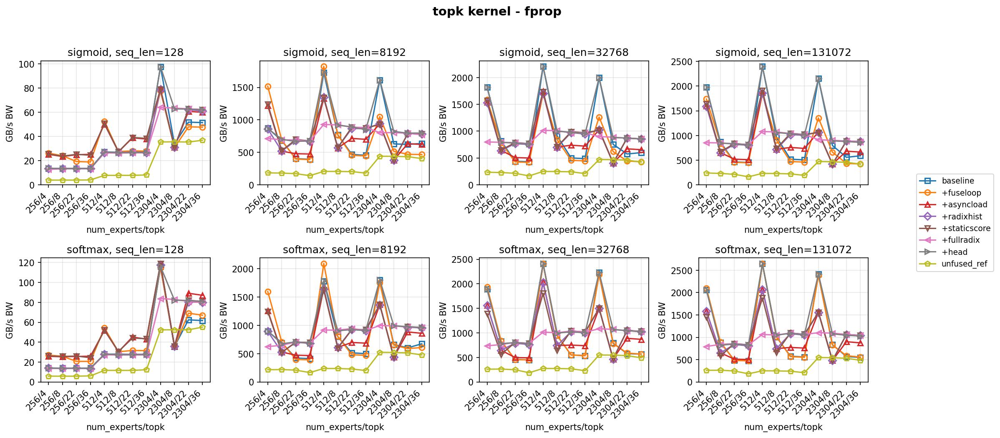
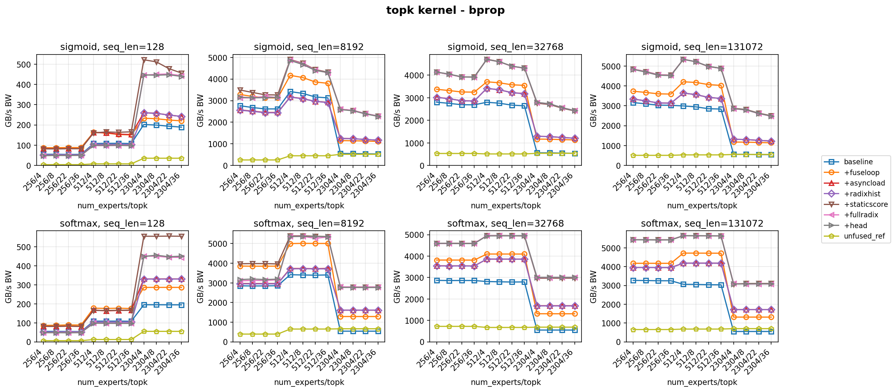
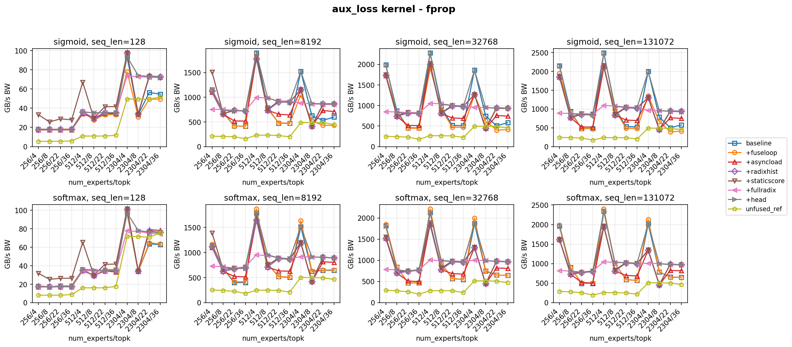
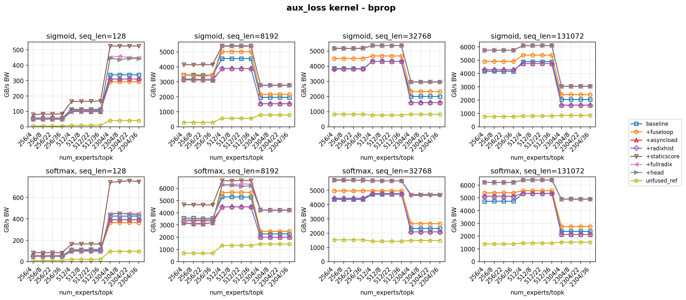

# TE Fused Router Further Optimizations

## Background

Sparser MoE setup:

- MoE in latent hidden dimension 512.
- EP72 on NVL72.
- 32 experts per EP rank, 2304 total experts, topk 36.
- Token counts: 4096 x 1 and 4096 x 2.

The fused router implementation lives under `transformer_engine/common/fused_router`. The relevant kernel paths are topk forward, aux-loss forward, topk backward, and aux-loss backward. The input is `[B*S, E]` logits and the output is `[B*S, E]` topk indices and scores.

## Radix Optimization

The original topk path repeatedly found the current max and masked already selected indices. This makes the forward selection cost scale poorly with large topk, effectively `O(topk^2)` inside the per-token selection loop.

```cpp
__device__ inline void naive_topk_and_mask(CompType *scores, int data_size, int topk,
                                           int *topk_indices, CompType *topk_scores,
                                           int lane_id) {
  auto is_masked = [&topk_indices](int k, int index) {
    if (k == 0) return false;
    for (int i = 0; i < k; i++) {
      if (topk_indices[i] == index) return true;
    }
    return false;
  };

  for (int k = 0; k < topk; k++) {
    CompType val = (lane_id < data_size && !is_masked(k, lane_id))
                       ? scores[lane_id]
                       : -std::numeric_limits<CompType>::infinity();
    int index = (lane_id < data_size) ? lane_id : 0;

    for (int i = lane_id + kThreadsPerWarp; i < data_size; i += kThreadsPerWarp) {
      CompType cur_val = (is_masked(k, i)) ? -std::numeric_limits<CompType>::infinity()
                                           : scores[i];
      if (cur_val > val) {
        val = cur_val;
        index = i;
      }
    }

    for (int s = 16; s > 0; s /= 2) {
      auto shuffled_val = __shfl_xor_sync(0xffffffff, val, s);
      auto shuffled_index = __shfl_xor_sync(0xffffffff, index, s);
      if (shuffled_val > val) {
        val = shuffled_val;
        index = shuffled_index;
      }
    }

    if (lane_id == 0) {
      topk_indices[k] = index;
      topk_scores[k] = val;
    }
    __syncwarp();
  }
}
```

The radix path selects with 4 bits at a time using 16 buckets, keeping the one-warp-per-token structure while reducing the selection work to `O(E)` per token. This optimization affects the forward kernels and is captured in Router P2 (upstream fused router, baseline), which is the baseline for the P3 further-optimization benchmark results in this note. For the Sparser MoE 2304/36 case, the initial radix optimization gives about 10x forward acceleration.

## Further Optimizations

The further-optimization phase starts from Router P2 (upstream fused router, baseline) and focuses on making the forward and backward kernels more efficient for large expert count and large topk. The main themes are reducing redundant loops, reducing shared-memory pressure, improving global-memory load behavior, controlling launch occupancy with persistent grids, reducing register pressure in radix bookkeeping, and removing dynamic score-function branches from hot paths.

### Fuse Preprocess and Backward Loops

The next step replaces multi-loop preprocess sequences, such as separate clear, load, score, save, and bias loops, with single fused loops per score function in all four kernel paths: topk forward, topk backward, aux-loss forward, and aux-loss backward.

The backward path also replaces multi-pass array helpers plus `comp_buf` shared memory with a two-pass scalar-helper structure. Pass 1 performs reductions with warp-level sums through `warp_allreduce_sum()`. Pass 2 performs scalar gradient computation and writes to global memory. This removes `comp_buf`, reducing backward shared memory by `E x W x sizeof(float)` per kernel.

### Async Loader and Double Buffering

The optimization adds `async_loader.h` with:

- `RawAsyncLoader<T>` using `cp.async` on `sm_80+`, with an `int4` fallback on `sm_70`, while storing data in the original type instead of converting during copy.
- `compute_persistent_grid()` for occupancy-based grid sizing.
- `choose_num_buffers()` for shared-memory-aware one-buffer versus two-buffer selection.
- `vec_fill_global()` and `vec_store_global()` helpers for vectorized global output.

Forward kernels load logits through `RawAsyncLoader` with double-buffered prefetch. The persistent-grid launch replaces the one-shot grid launch, type conversion is delayed until compute, and `vec_fill_global` is used when clearing `probs` and `routing_map`.

Backward kernels load all inputs through `RawAsyncLoader`. Topk backward uses three loaders for gradient, activation, and mask. Aux-loss backward uses two loaders for gradient and activation. The backward paths are always double-buffered with `kBwdNumBuffers=2` and `kAuxBwdNumBuffers=2`.

### Radix Topk 8-Bit Histogram

The radix histogram packs `counts[16]` from 64 bytes per thread down to 16 bytes, reducing register pressure.

### Static Score Function Templates

Static score-function templates eliminate dynamic score-function logic from the optimized kernel path.

## P3 Further-Optimization Benchmark Results

The following plots compare Router P2 (upstream fused router, baseline) against the incremental P3 optimizations: fused loops, async loading, radix histogram packing, static score-function templates, and `+fullradix`. In these plots, `+fullradix` is the final optimized version.









## Bandwidth Improvements over Router P2

These results use sequence length 8192 and report effective bandwidth. The baseline column is Router P2 (upstream fused router, baseline), and each subsequent column adds one P3 optimization stage. The `+fullradix` column is the final optimized version.

| kernel   | pass  | config  | baseline | +fuseloop        | +asyncload       | +radixhist       | +staticscore     | +fullradix       | +head            |
| -------- | ----- | ------- | -------- | ---------------- | ---------------- | ---------------- | ---------------- | ---------------- | ---------------- |
| topk     | fprop | 256/8   | 691.0    | 702.8 (+1.7%)    | 528.0 (-23.6%)   | 526.4 (-23.8%)   | 518.6 (-24.9%)   | 646.9 (-6.4%)    | 673.8 (-2.5%)    |
| topk     | fprop | 512/22  | 513.7    | 479.7 (-6.6%)    | 696.8 (+35.7%)   | 927.4 (+80.5%)   | 921.9 (+79.5%)   | 942.5 (+83.5%)   | 923.5 (+79.8%)   |
| topk     | fprop | 2304/36 | 673.1    | 607.7 (-9.7%)    | 858.2 (+27.5%)   | 954.2 (+41.8%)   | 955.9 (+42.0%)   | 963.7 (+43.2%)   | 964.0 (+43.2%)   |
| topk     | bprop | 256/8   | 2842.7   | 3847.4 (+35.3%)  | 2964.9 (+4.3%)   | 2948.0 (+3.7%)   | 3982.5 (+40.1%)  | 3122.2 (+9.8%)   | 3197.2 (+12.5%)  |
| topk     | bprop | 512/22  | 3391.1   | 5005.2 (+47.6%)  | 3721.8 (+9.8%)   | 3712.2 (+9.5%)   | 5372.8 (+58.4%)  | 5266.1 (+55.3%)  | 5362.0 (+58.1%)  |
| topk     | bprop | 2304/36 | 542.6    | 1289.5 (+137.6%) | 1613.1 (+197.3%) | 1614.6 (+197.5%) | 2791.8 (+414.5%) | 2791.7 (+414.5%) | 2765.7 (+409.7%) |
| aux_loss | fprop | 256/8   | 678.4    | 681.8 (+0.5%)    | 623.8 (-8.0%)    | 624.0 (-8.0%)    | 657.0 (-3.2%)    | 715.4 (+5.4%)    | 710.5 (+4.7%)    |
| aux_loss | fprop | 512/22  | 519.4    | 519.7 (+0.0%)    | 632.9 (+21.8%)   | 876.9 (+68.8%)   | 887.7 (+70.9%)   | 890.8 (+71.5%)   | 896.4 (+72.6%)   |
| aux_loss | fprop | 2304/36 | 644.8    | 653.1 (+1.3%)    | 804.4 (+24.8%)   | 895.1 (+38.8%)   | 888.5 (+37.8%)   | 887.5 (+37.6%)   | 891.3 (+38.2%)   |
| aux_loss | bprop | 256/8   | 3561.9   | 3427.5 (-3.8%)   | 3085.0 (-13.4%)  | 3358.4 (-5.7%)   | 4655.9 (+30.7%)  | 3127.0 (-12.2%)  | 3109.5 (-12.7%)  |
| aux_loss | bprop | 512/22  | 5288.7   | 5688.1 (+7.6%)   | 4491.3 (-15.1%)  | 4481.7 (-15.3%)  | 6647.5 (+25.7%)  | 6368.4 (+20.4%)  | 6154.8 (+16.4%)  |
| aux_loss | bprop | 2304/36 | 2271.8   | 2485.1 (+9.4%)   | 1995.0 (-12.2%)  | 1996.8 (-12.1%)  | 4227.5 (+86.1%)  | 4236.5 (+86.5%)  | 4201.0 (+84.9%)  |

## Notes

- The initial radix optimization was merged as Transformer Engine PR #2821 and is represented here as Router P2 (upstream fused router, baseline).
- The P3 work broadens the optimization from forward selection into forward/backward kernel structure, shared-memory pressure, async loading, persistent launch sizing, histogram packing, and score-function dispatch removal.
- The largest gains in this phase are in backward-heavy cases: topk bprop improves by +261.7% for 2304/36, and aux-loss bprop improves by +104.5% for 2304/36.
