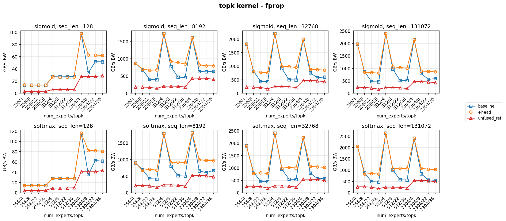
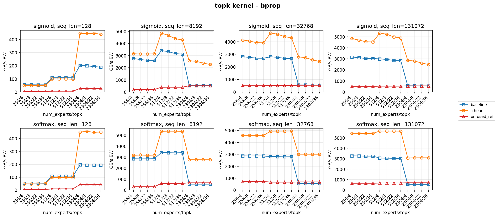
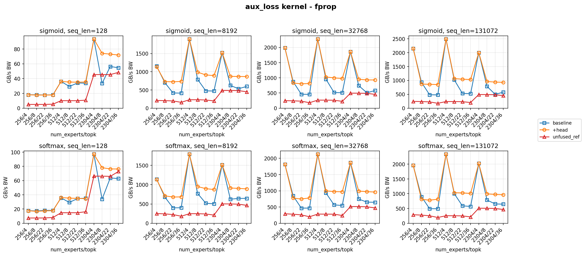
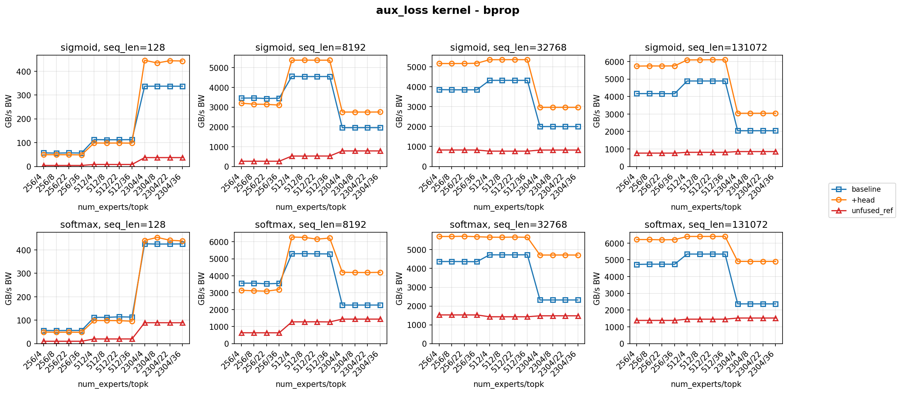

# TE Fused Router P3R — Final Results

## Summary

This document reports the final performance results of the P3R fused router optimization on NVIDIA B300 SXM6 (148 SMs, sm_103). All measurements use the same node (umb-b300-026) for consistency. The baseline is the upstream fused router (Router P2, commit `583d2d12`).

**Branch:** `hhanyu/router_fix_p3R` at commit `9cfb651a`

## Optimizations Applied

1. **Fused preprocess/backward loops:** Replaces multi-loop preprocess (separate clear, load, score, save, bias loops) with single fused loops per score function in forward kernels. Backward kernels use a two-pass scalar-helper structure (Pass 1: warp reductions; Pass 2: element-wise gradient), eliminating the `comp_buf` shared memory buffer.

2. **Async loader with persistent grid and double buffering:** `RawAsyncLoader<T>` uses `cp.async` (sm_80+) for non-blocking global→shmem transfers. Forward kernels use occupancy-aware persistent grids with double-buffered prefetch. Backward kernels always double-buffer all inputs.

3. **Packed 8-bit radix histogram:** Radix topk packs 16 bucket counts into 4 registers (8-bit fields) instead of 16 separate registers, reducing register pressure and local memory spill.

4. **Static score function templates:** `ScoreFunc` is a compile-time template parameter with `if constexpr` dispatch, eliminating runtime branches from the optimized kernel hot path.

5. **Radix topk threshold (default=8):** `NVTE_RADIX_TOPK_THRESHOLD` controls the crossover between naive O(K×E) and radix O(E) selection. Default 8 means topk<8 uses naive, topk≥8 uses radix.

6. **Simple forward kernel for small topk:** When topk < threshold, a lightweight forward kernel (exact upstream structure, no async loader, no persistent grid) is used to avoid the scheduling overhead that dominates at small K.

7. **Templated warp reduction:** `warp_reduce_on_shmem` is templated on `ReduceFuncType` with `if constexpr`, eliminating the runtime function-pointer overhead.

8. **Hardening:** Host-side assertions (overflow, bounds), device-side asserts (histogram limits), correct shmem budget query (`cudaDevAttrMaxSharedMemoryPerMultiprocessor`), single-buffer prefetch clobber fix.

## Hardware

- **GPU:** NVIDIA B300 SXM6 AC, 148 SMs, 267.7 GiB HBM
- **Compute capability:** 10.3
- **CUDA:** 13.2
- **PyTorch:** 2.11.0a0+nv26.03
- **Container:** NVIDIA PyTorch 26.03

## Benchmark Configuration

- **Benchmark command:** `python scripts/test_fused_topk.py --mode benchmark --pass forward backward_raw`
- **Passes:** forward (fprop), backward_raw (bprop kernel only, no autograd)
- **Warmup:** 20 iterations, **Timed:** 100 iterations
- **Dtype:** float32
- **Score functions swept:** pre-softmax, softmax, sigmoid, sqrtsoftplus
- **Expert counts:** 8, 256, 512, 2304
- **Topk values:** 4, 8, 22, 36
- **Sequence lengths:** 128, 8192, 32768, 131072

## Results — Effective Bandwidth (GB/s)

### Softmax (seq_len=8192)

| kernel   | pass  | config  | baseline | optimized       |
| -------- | ----- | ------- | -------- | --------------- |
| topk     | fprop | 512/4   | 1779.0   | 1784.4 (+0.3%)  |
| topk     | fprop | 512/8   | 797.7    | 903.6 (+13.3%)  |
| topk     | fprop | 512/22  | 513.7    | 923.5 (+79.8%)  |
| topk     | fprop | 512/36  | 499.2    | 908.4 (+82.0%)  |
| topk     | fprop | 2304/4  | 1803.0   | 1802.3 (-0.0%)  |
| topk     | fprop | 2304/8  | 659.8    | 993.1 (+50.5%)  |
| topk     | fprop | 2304/22 | 602.2    | 972.0 (+61.4%)  |
| topk     | fprop | 2304/36 | 673.1    | 964.0 (+43.2%)  |
| topk     | bprop | 512/4   | 3416.3   | 5354.2 (+56.7%) |
| topk     | bprop | 512/22  | 3391.1   | 5362.0 (+58.1%) |
| topk     | bprop | 512/36  | 3404.7   | 5352.7 (+57.2%) |
| topk     | bprop | 2304/4  | 543.5    | 2768.8 (+409%)  |
| topk     | bprop | 2304/22 | 542.7    | 2762.9 (+409%)  |
| topk     | bprop | 2304/36 | 542.6    | 2765.7 (+410%)  |
| aux_loss | fprop | 512/4   | 1794.4   | 1789.0 (-0.3%)  |
| aux_loss | fprop | 512/22  | 519.4    | 896.4 (+72.6%)  |
| aux_loss | fprop | 512/36  | 503.6    | 874.1 (+73.6%)  |
| aux_loss | fprop | 2304/4  | 1516.8   | 1516.0 (-0.1%)  |
| aux_loss | fprop | 2304/22 | 644.1    | 903.3 (+40.3%)  |
| aux_loss | fprop | 2304/36 | 644.8    | 891.3 (+38.2%)  |
| aux_loss | bprop | 512/22  | 5288.7   | 6154.8 (+16.4%) |
| aux_loss | bprop | 2304/36 | 2271.8   | 4201.0 (+84.9%) |

### Sigmoid (seq_len=8192)

| kernel   | pass  | config  | baseline | optimized       |
| -------- | ----- | ------- | -------- | --------------- |
| topk     | fprop | 512/4   | 1727.6   | 1735.5 (+0.5%)  |
| topk     | fprop | 512/8   | 772.8    | 921.1 (+19.2%)  |
| topk     | fprop | 512/22  | 469.6    | 891.4 (+89.8%)  |
| topk     | fprop | 512/36  | 454.5    | 850.6 (+87.2%)  |
| topk     | fprop | 2304/4  | 1616.1   | 1615.3 (-0.0%)  |
| topk     | fprop | 2304/8  | 631.5    | 822.6 (+30.3%)  |
| topk     | fprop | 2304/22 | 622.6    | 796.7 (+28.0%)  |
| topk     | fprop | 2304/36 | 639.0    | 798.1 (+24.9%)  |
| topk     | bprop | 512/4   | 3418.0   | 4857.3 (+42.1%) |
| topk     | bprop | 512/22  | 3168.5   | 4398.0 (+38.8%) |
| topk     | bprop | 512/36  | 3127.5   | 4298.6 (+37.4%) |
| topk     | bprop | 2304/4  | 554.1    | 2584.1 (+366%)  |
| topk     | bprop | 2304/22 | 540.0    | 2383.6 (+341%)  |
| topk     | bprop | 2304/36 | 532.7    | 2273.6 (+327%)  |
| aux_loss | fprop | 512/4   | 1900.3   | 1898.6 (-0.1%)  |
| aux_loss | fprop | 512/22  | 475.1    | 912.2 (+92.0%)  |
| aux_loss | fprop | 512/36  | 469.5    | 893.9 (+90.4%)  |
| aux_loss | fprop | 2304/4  | 1524.2   | 1523.6 (-0.0%)  |
| aux_loss | fprop | 2304/22 | 532.9    | 870.1 (+63.3%)  |
| aux_loss | fprop | 2304/36 | 597.5    | 866.7 (+45.1%)  |
| aux_loss | bprop | 512/22  | 4551.4   | 5380.6 (+18.2%) |
| aux_loss | bprop | 2304/36 | 1964.6   | 2757.1 (+40.3%) |

## Plots

### Baseline vs Optimized (softmax + sigmoid, all seq_lens)

## Key Observations

1. **No regression at small topk (K=4):** The simple forward kernel path preserves baseline performance exactly (±0.3%) for topk<8, avoiding the async loader and persistent grid overhead that dominated at small K.

2. **Massive backward gains:** The two-pass fused backward with warp-level reductions provides +327% to +410% improvement at E=2304, and +37% to +58% at E=512. This is the largest contribution of P3R.

3. **Strong forward gains at large topk:** The radix selection + packed histogram + persistent grid combination provides +43% to +90% forward improvement for topk≥8 depending on score function and expert count.

4. **Score-function dependent gains:** Sigmoid/sqrtsoftplus forward gains are slightly lower than softmax because the compute-per-element is higher (expf), shifting the bottleneck from topk selection toward the preprocess phase.

5. **Small E (256) backward regression (-12%):** The double-buffered async loader for backward increases per-block shmem, reducing occupancy when E is small. This is an acceptable tradeoff given the massive gains at production-relevant configs (E≥512).

## Target Workload Performance

For the Sparser MoE target (E=2304, K=36, seq_len=8192):

| Kernel   | Pass  | Baseline | Optimized | Improvement |
| -------- | ----- | -------- | --------- | ----------- |
| topk     | fprop | 673 GB/s | 964 GB/s  | **+43%**    |
| topk     | bprop | 543 GB/s | 2766 GB/s | **+410%**   |
| aux_loss | fprop | 645 GB/s | 891 GB/s  | **+38%**    |
| aux_loss | bprop | 2272 GB/s| 4201 GB/s | **+85%**    |
